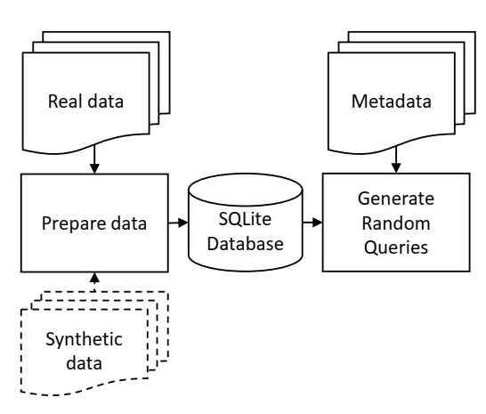

About Fuzzy SQL
===============

`Fuzzy SQL <https://github.com/skababji-ehil/fuzzy_sql>`_ generates semantically and syntactically valid SELECT random queries that can be applied to tabular and longitudinal datasets stored in an  `SQLite <https://www.sqlite.org/index.html>`_ database.

The project was developed and maintained by `Samer El Kababi <https://www.linkedin.com/in/samer-el-kababji-92906251/>`_  under `Electronic Health Information Laboratory (EHIL) <https://www.ehealthinformation.ca/home>`_. EHIL was formed in 2005 at the `CHEO Research Institute <https://www.cheoresearch.ca/>`_.  

The package is mainly used to compare the responses of real and synthetic datasets against valid random SELECT queries. The tool returns all query results along with the corresponding query parameters such as the SQL statement. The query results may be further analyzed to measure distances between real and synthetic responses.

A simplified flow is shown in the figure below. The dotted lines indicate that the synthetic data input is optional, although the package is mainly developed to compare the random query results for any real dataset and its synthetic counterpart. The input datasets may be either tabular or longitudinal.

We define two basic types of random SELECT queries, namely, 'filter' and 'aggregate' queries. We further combine these into a third type and we call it 'filter-aggregate' query.   Metrics, such as the Hellinger distance, can be applied to the results of any aggregate query.

If the input data includes continuous variables, various 'aggregate functions' may be randomly applied in addition to counting the resulting number of records. These functions are limited to AVG, SUM, MIN and MAX. If the input does not include any continuous variable, only the COUNT aggregate function is applied. The types of each variable are typically defined by the user and inputted along with the real and synthetic datasets.

The package is versatile and allows the customization of various parameters including the type of logical and comparison operations and their associated discrete probabilities that are used to generate random queries. For instance, assigning to the 'AND' logical operation a probability of 0.9 while assigning the 'OR operation a probability of 0.1 will result in more AND'ed conditions than OR'ed in the WHERE clause.  

